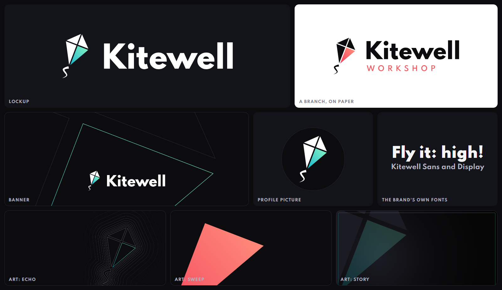

# pubskills

Skills for Claude Code and other coding agents, by [bbirdg](https://github.com/bbirdg).

| Skill | What it does |
| --- | --- |
| [brand-system](skills/brand-system/) | Builds a whole brand design system from a logo, or from nothing |

## brand-system

Give it a logo (or just a name) and it works with you to build everything a brand needs to look the same
everywhere:

- **The mark**, cleaned up or drawn, as one tidy SVG
- **Every logo file**: the mark alone, with the name beside it and under it, square icons, profile pictures and
  favicons, in every colourway, as SVG and PNG
- **Colours and design tokens** as CSS variables and JSON, with contrast checked
- **The brand's own font family**, built from open-licensed fonts, with the mark as a character in it
- **Background art** drawn from the mark, in three shapes and two tones, each with a marked place for a logo
- **Animated logos**: an intro and a loop, as MP4, ProRes 4444 and transparent WebM
- **An upload kit**: profile pictures, banners, favicons and icons at each platform's size
- **One review page** that shows it all, lets you download any file, and lists what goes where



Kitewell is a made-up kite maker. It ships with the skill as a finished example, and everything in the picture was
made by the skill from one drawing, two colours and one typeface.

### How it works

An engine does the drawing: it turns one settings file and one drawing of the mark into every file. The assistant
brings the judgement and you make the decisions. It stops and waits for you three times:

1. **The mark.** Your logo, corrected, beside the original. Or three directions if you have none.
2. **Colour and type.** Real lockups side by side, not swatches.
3. **Motion.** One animation to look at before the whole set is rendered.

Then you get one page to review. Nothing is uploaded or published by the skill, ever. It makes files, and you
decide what goes live.

### Install

As a Claude Code plugin:

```text
/plugin marketplace add bbirdg/pubskills
/plugin install brand-system@pubskills
```

If the first line stops with a message about SSH or a host key, give the full address instead:
`/plugin marketplace add https://github.com/bbirdg/pubskills.git`

Or with the skills CLI, for Claude Code and other agents:

```bash
npx skills add bbirdg/pubskills --skill brand-system
```

Then ask for what you want ("make a brand system for my logo") or type `/brand-system`. The first time, it checks
your computer and installs what it needs.

### What it needs

| | For | Notes |
| --- | --- | --- |
| Node 18 or later | everything | |
| About 400 MB of disk | everything | Its libraries and a private copy of Chromium go into `.brand-system` in your home folder |
| Python 3.9 or later | the font family | Everything else works without it |
| ffmpeg | animated logos and moving art | Everything else works without it |

Built and tested on Windows 11. macOS and Linux should work and have not been tried yet. On Linux, Chromium may ask
for system libraries: `npx playwright install-deps chromium` installs them.

A brand folder can hold code of its own (a mark that moves in its own way is a small script). The engine runs
it, so build only brand folders you trust, as you would with any project.

### Try the example

```bash
git clone https://github.com/bbirdg/pubskills
cd pubskills/skills/brand-system
node engine/run.js setup
node engine/run.js all example
```

That builds Kitewell in about half a minute. Open `example/final/review.html`. Add `--motion` to render its
animated logos too, which takes about five minutes.

### What it does not do

- It draws **flat marks made of shapes**. A mark with shading, photographs or 3D needs code of its own.
- Whether a mark is good, how it should move and which font suits it are judgement. The skill guides the
  assistant and you decide. It cannot promise taste.
- Brands at home on dark surfaces are the well-trodden path. Light-first brands work and are less tested.
- A second script in the font family is tested with Arabic. Others follow the same path and are untested.
- Platform picture sizes are the ones in common use when this was written. Check each in its upload dialog.
- It does not tell you whether a name or a logo is free to use. That is a trademark search and, if it matters, a
  lawyer.

### Licence and credit

Made by [bbirdg](https://github.com/bbirdg). Apache License 2.0: use it, change it, share it, and keep the
[NOTICE](NOTICE) with it. The example's typeface, Spartan, is under the SIL Open Font License and its licence is
beside it.
