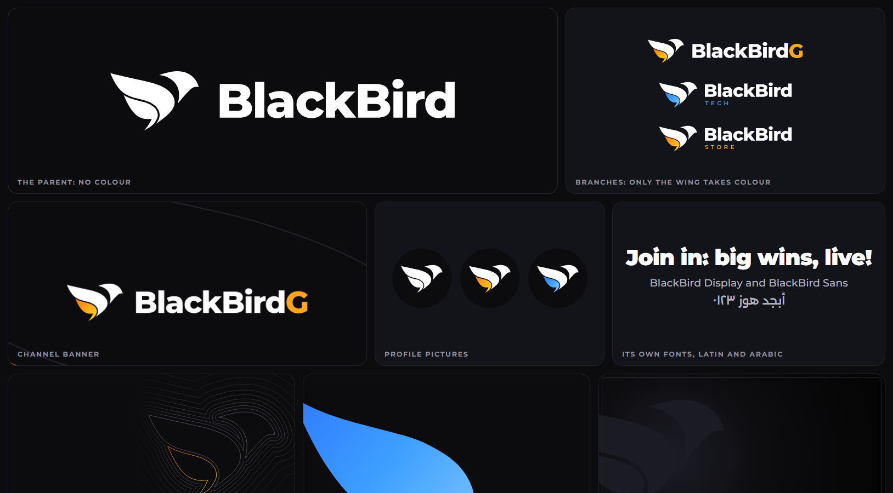
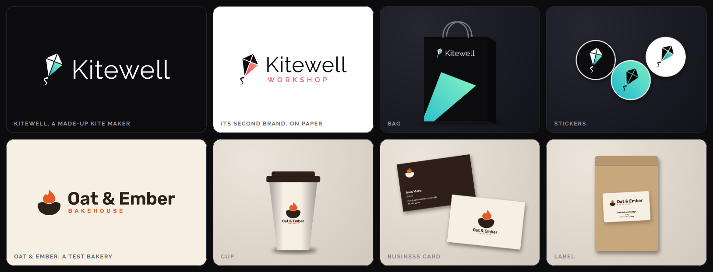

# pubskills

Skills for coding agents (Claude Code, Codex and others), by [bbirdg](https://github.com/bbirdg).

| Skill | What it does |
| --- | --- |
| [brand-system](skills/brand-system/) | Builds a whole brand design system from a logo, or from nothing |

## brand-system

Give it a logo (or just a name) and it works with you to build everything a brand needs to look the same
everywhere.



**This is the real one.** BlackBird is bbirdg's own brand: a gaming channel (BlackBirdG), a tech channel and a
store that share one bird, where only the wing changes colour. Its system was designed first, and this skill is
that work made reusable. Everything in the picture is made by the engine in this repository from one drawing of
the bird, a few colours and two open typefaces. As a test, the engine remakes that whole system and the files come
out the same: 1,164 of 1,167 logo, art and upload files byte for byte (the other three carry a date), every font
identical table by table, and every frame compared in its 60 animated logos.


### What it makes

- **The mark**, cleaned up or drawn, as one tidy SVG
- **Every logo file**: the mark alone, with the name beside it and under it, square icons, profile pictures and
  favicons, in every colourway, as SVG and PNG
- **Colours and design tokens** as CSS variables and JSON, with contrast checked
- **The brand's own font family**, built from an open typeface chosen for that brand, with the mark as a
  character in it
- **Background art** drawn from the mark, in three shapes and two tones, each with a marked place for a logo
- **Animated logos**: an intro and a loop, as MP4, ProRes 4444 and transparent WebM
- **An upload kit**: profile pictures, banners, favicons and icons at each platform's size
- **Branded items**, picked for what the brand is: business cards, letterheads, stickers, tags, labels, bags, cups,
  boxes, totes, posters and signs, each at real size with a print file and a picture of the thing
- **One review page** that shows it all, lets you download any file, and lists what goes where

Files come as SVG, PNG, ICO, PDF, TTF, WOFF2, MP4, MOV and WebM. The master sheets and the print files are vector
PDF and SVG with every word as outlines, so they open in Illustrator, Affinity, Figma and Inkscape as shapes you
can edit. Illustrator's own `.ai` is one "Save as" from there.

### How it works

An engine does the drawing: it turns one settings file and one drawing of the mark into every file. The assistant
brings the judgement and you make the decisions. It stops and waits for you at each of them:

1. **The mark.** Your logo, corrected, beside the original. Or three directions if you have none.
2. **Colour.** Real logo files side by side, on dark and on light. Not swatches.
3. **Type.** Your real logo set in three or four typefaces of different character, light and heavy. Every brand
   gets its own: nothing is carried over from the last one.
4. **Items.** The few things your kind of brand really uses, proposed and then built only if you say so.
5. **Motion.** One animation to look at before the whole set is rendered.

Then you get one page to review. Nothing is uploaded, published or sent to a printer by the skill, ever. It makes
files, and you decide what goes live.

### Also tested on



- **Kitewell**, a made-up kite maker. It ships with the skill as a finished example you can build yourself: two
  brands on one mark, a motion of its own (the kite rises on the wind), and ten items.
- **Oat & Ember**, a test bakery, light first, in cream and brown. An assistant with nothing but this skill built
  it from a picture of a logo. What tripped it up was fixed, and it was built again.
- **Edge cases**: a name with an ampersand, two brands that share the same places, a mark of one shape with no
  accent colour, and typefaces with rules the outline library cannot read.

### Install

As a Claude Code plugin:

```text
/plugin marketplace add bbirdg/pubskills
/plugin install brand-system@pubskills
```

If the first line stops with a message about SSH or a host key, give the full address instead:
`/plugin marketplace add https://github.com/bbirdg/pubskills.git`

For Codex, Cursor, Gemini CLI, OpenCode, Copilot and other agents, with the skills CLI. It asks which agents to
install for, or you name one:

```bash
npx skills add bbirdg/pubskills --skill brand-system
```

```bash
npx skills add bbirdg/pubskills --skill brand-system --agent codex
```

Or by hand: copy the folder `skills/brand-system` to where your agent reads skills (`.claude/skills/` for Claude
Code, `.agents/skills/` for Codex and most others, in a project or in your home folder).

Then ask for what you want ("make a brand system for my logo"), or call it by name: `/brand-system` in Claude
Code, `$brand-system` in Codex. The first time, it checks your computer and installs what it needs, after telling
you what that is.

The skill follows the open [Agent Skills](https://agentskills.io) format and uses nothing that only one agent
understands. So far it has been run in Claude Code only. In an agent that runs commands in a sandbox (Codex does
by default), the one-time setup needs your approval, because it downloads its libraries and a browser.

### What it needs

| | For | Notes |
| --- | --- | --- |
| Node 18 or later | everything | |
| About 750 MB of disk | everything | Its libraries go into `.brand-system` in your home folder (50 MB), and a copy of Chromium into Playwright's cache (700 MB). `BRAND_SYSTEM_HOME` moves both |
| Python 3.9 or later | the font family | Everything else works without it |
| ffmpeg | animated logos and moving art | Everything else works without it |

Built and tested on Windows 11. macOS and Linux should work and have not been tried yet. On Linux, Chromium may ask
for system libraries: `npx playwright install-deps chromium` installs them.

A brand folder can hold code of its own (a mark that moves in its own way is a small script). The engine runs
it, so build only brand folders you trust, as you would with any project.

### Try the example

```bash
git clone https://github.com/bbirdg/pubskills
cd pubskills/skills/brand-system
node engine/run.js setup
node engine/run.js all example
```

That builds Kitewell in under a minute. Open `example/final/review.html`. Add `--motion` to render its animated
logos too, which takes about five minutes.

### What it does not do

- It draws **flat marks made of shapes**. A mark with shading, photographs or 3D needs code of its own.
- Whether a mark is good, which typeface suits it and how it should move are judgement. The skill guides the
  assistant and you decide. It cannot promise taste.
- **Print files are RGB PDF with bleed**, not CMYK, and bags, cups and boxes are art for a face, not a maker's
  template. A printer may ask for more. The pictures of items are drawings, not photographs.
- A second script in the font family is tested with Arabic. Others follow the same path and are untested.
- Platform picture sizes are the ones in common use when this was written. Check each in its upload dialog.
- It does not tell you whether a name or a logo is free to use. That is a trademark search and, if it matters, a
  lawyer.

### Licence and credit

Made by [bbirdg](https://github.com/bbirdg). Apache License 2.0: use it, change it, share it, and keep the
[NOTICE](NOTICE) with it.

The BlackBird name, its logo and the pictures of them here are not part of that licence. They are bbirdg's own
brand, shown as an example, and all rights in them are reserved.

The example's typeface, Raleway, is under the SIL Open Font License and its licence is beside it.
